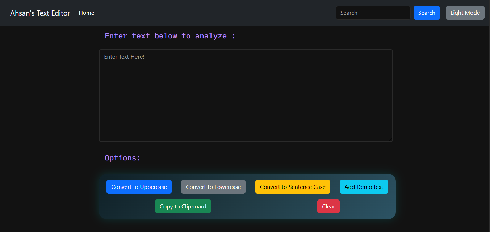

# React Text Editor

A modern **React-based Text Editor** with live text analysis, summary features, and theme toggling. Built using **React, Bootstrap, and custom CSS**.

---

## Table of Contents
- [Features](#features)
- [Demo](#demo)
- [Installation](#installation)
- [Usage](#usage)
- [Technologies](#technologies)
- [Contributing](#contributing)
- [License](#license)

---

## Features

- **Live Text Input:** Type text and see it reflected instantly.
- **Text Summary:** Shows word count, character count, and reading time.
- **Dark/Light Mode Toggle:** Stylish rounded toggle for theme switching.
- **Responsive Design:** Works on desktop and mobile devices.
- **Custom Styling:** Unique UI design with Bootstrap components and enhanced visuals.

---

## Demo

Include a screenshot or GIF of your app here:



Or link to live demo if hosted:

[Live Demo](https://your-demo-link.com)

---

## Installation

1. Clone the repository:

```bash
git clone https://github.com/ahsand871/React-text-editor.git
